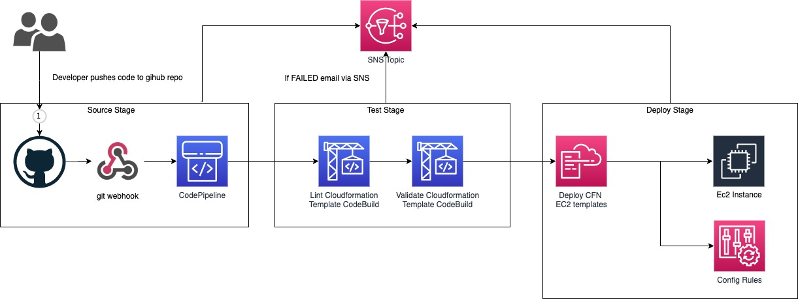

# Data Science Lab Notebook pipeline 

On this project file you will find all the necessary artifacts to build an ec2 instance with a config rule and 
evaluates when a public IP is assigned in the instance.
Additionally a CodePipeline can be provisioned to orchestrate the ec2 infrastructure.

## CodePipeline
The CodePipeline triggers when new code is merge in a branch (master by default) of a github  repository.
Afterwards it validates and lints the cloudformation templates.
If the templates are in the correct state then it will trigger a CodeDeploy which will deploy
the CloudFormation template for the ec2 and config resources.
If the pipeline fails in any stage it will send an SNS topic notification to the given email address.   

### CodePipeline diagram
Bellow there are details of how to deploy and how each component has been implemented.


### Prerequisites 
- GNU make installed
- AWS cli installed
- python3.6+
- pip
- Environmental Variables:
    The following environmental variables need to be exported:
    - `CODEPIPELINE_STACK_NAME` The name of the codepipeline cloudformation stack
    - `GITHUB_OWNER` The owner/team/project name 
    - `GITHUB_REPO` The source code github repository name to be used as Pipeline's source stage. 
    - `SNS_EMAIL_ADDRESS` The email address to send sns notification events from the pipeline 
    - `EC2_SUBNET_ID` The EC2 Subnet Id belonging in the VPC you want to use for the EC2 deployment.

The above env variables can be configured in the `makefile.env` file for convenience.
- `GITHUB ACCESS TOKEN` A github secret token is needed. A guide of how to create one can be found at https://docs.aws.amazon.com/codepipeline/latest/userguide/GitHub-authentication.html
- The content of this project push in the github repo used by the source stage of the CodePipeline

CodeDeploy requires some parameters to be set to be able to provision the EC2 and Config Resource.
The Parameters can be set in the `ec2-template-parameters.json` file, located at the project root directory.
Example of ec2-template-parameters.json:
```json 
{
  "Parameters": {
    "SubnetId": "subnet-07f5fa2adb810122e",
    "InstanceType": "t2.micro",
    "GoldenAmiIdSsmParameterName": "/latest/golden-ami-id",
    "EnableSSMSessionManager": "yes"
  }
}
```
You can find more details of the above parameters in the Parameters section of the `tempates/ec2.template.yaml` template.

### Deploying the Pipeline
The cloudformation template that deploys the CodePipeline resources is located at `templates/pipeline.template.yaml`.
To deploy the codepipeline resources you can run the following command in the project root directory:
```shell script
make create-pipeline 
```
### Updating the Pipeline
If a change has been made in the CodePipeline CloudFormation template, you can update the CloudFormation stack by running:
```shell script
make update-pipeline
```
### Deleting the Pipeline
To delete the CodePipeline you can run:
make delete-pipeline

#### What has been deployed?
- An S3 bucket containing the artifacts of the pipeline.
- An SSM parameter with the S3 bucket name as value, to be used on other stacks. 
- An SNS topic with an email subscription, to be used for notification of the pipeline. The email address of the recipient equals to `SNS_EMAIL_ADDRESS`.
- IAM Roles for `CodeBuild`, `CodePipeline` and `Cloudformation`
- A Github webhook which will trigger the CodePipeline when new code will be pushed in the given `GITHUB_BRANCH`.
- An AWS CodePipeline with the following stages:
   
    1. Source Stage: Will be a Github repository matching a branch. When a new commit will be push in the defined `GITHUB_BRANCH`, the stage will pull the new code and trigger the next stage. The `GITHUB_*` env variables will be parsed in this stage.
    2. Test Stage: On the `Test Stage` CodeBuild Projects will be triggered which will lint and validate cloudformation templates.
    3. Deploy Stage: The `Deploy Stage` stage has 3 Actions:
        1. DeployEc2 Action: It will trigger and Cloudformation deployment for the `datalake/template.yml` cloudformation template, using the `parameters.json` configuration.

### Validating the CFN templates manually
In the root of the project install the `requirements.txt`:
    `pip install --upgrade requirements.txt`
Afterwards upgrade the cfn-lint database:
    `cfn-lint -u -I`
Validate the templates:
    `cfn-lint -I -o ./validate/cfn-lint/spec.json -a validate/cfn-lint/rules -t pipeline.yml templates/*.yml`

There are some custom spec and rules to make the validation a bit more strict.
    - Alert if S3 buckets have no Encryption
    - Alert if Resources have no tags 

## What to improve
Improve the arguments and environment parsing for docker and cloudformation.
Create different stages per environment and approval action.
Implement integration tests for the application.
Create CloudWatch alerts to send and SNS notification if a CodePipeline Stage fails.
